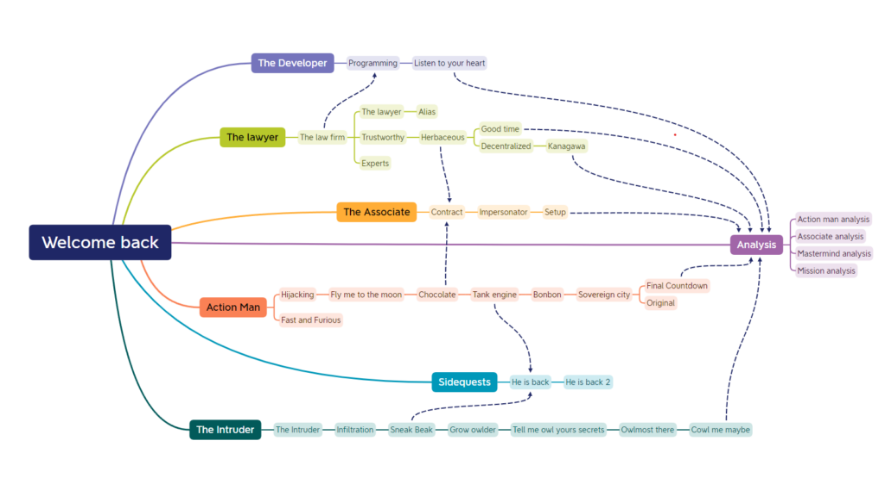
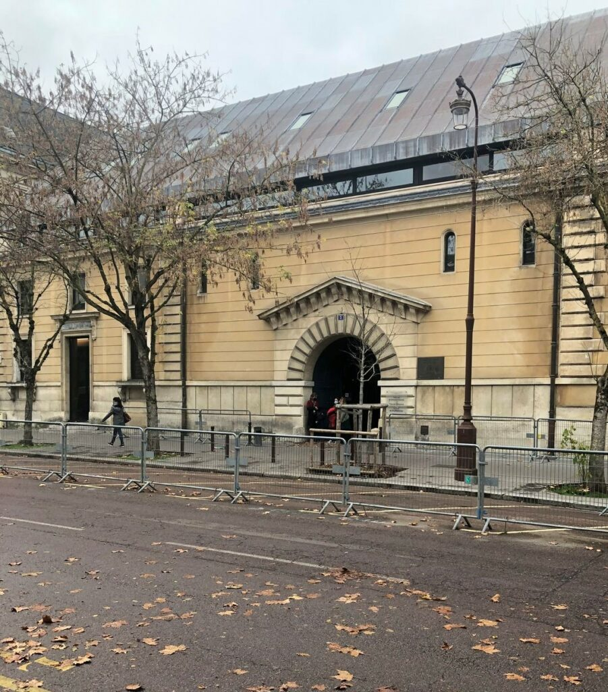
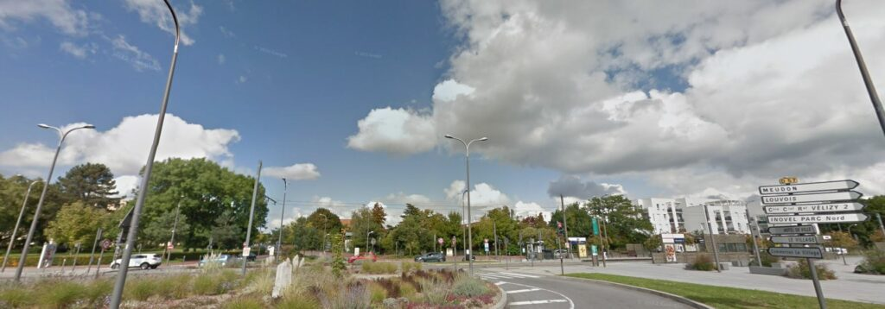
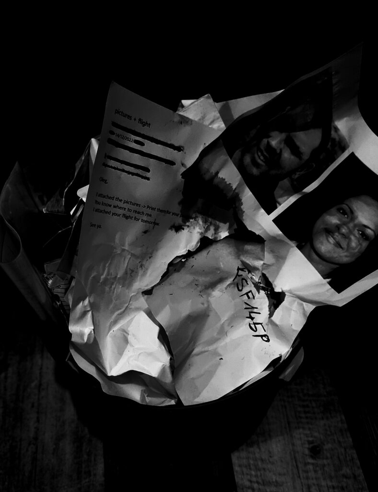
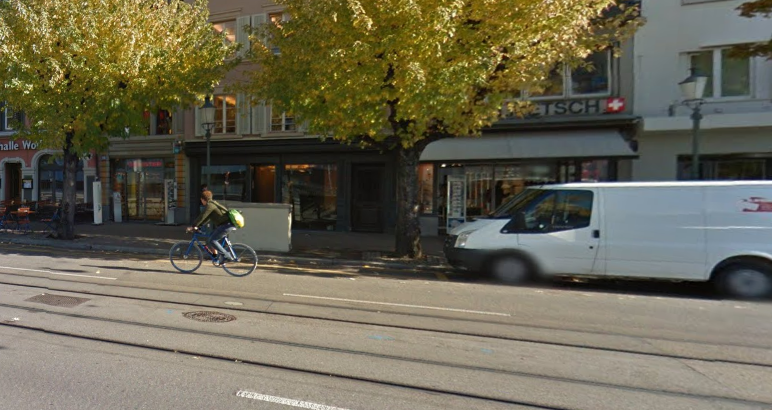
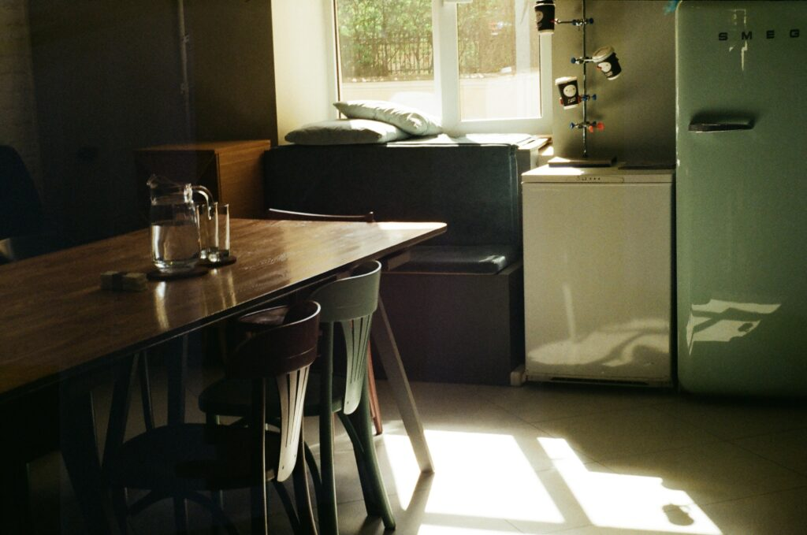

# Hexa CTF V2

## Introduction

### Welcome back

> Dear agents,
> 
> 
> You provided an outstanding work with the Manipar case just over a year ago. This group of activists, who met on Erasmus, stole data from sensitive sectors (bank, healthcare, military), to resell them to the highest bidders.
> 
> With their arrest, this case is therefore closed. However, their leader, Lucilhe Dumarquais disappeared during a transfer. She intended to reveal more information about collaborating criminal organizations. Since then, there is no trace of her.
> 
> The investigation reached a dead end. The minister asked to carry on. Given your knowledge of the case, you are assigned to take over and understand this disappearance.
> 
> We will ask you to provide every answer onto that format :
> 
> HEXA{challenge_answer} (case insensitive, dash/underscore/space accepted, no
> 
> accent).
> 
> If you understood the instructions, write HEXA{Briefing_OK}.
> 

This introduction sets the context and exposes two very important pieces of information: The starting point of the investigation is the disappearance of Lucilhe Dumarquais, and Lucilhe was selling sensitive information before being arrested.

As written in the challenge statement, the flag was **HEXA{Briefing_OK}**.

Once the challenge was solved, 4 new challenges were unlocked: Hijacking, Fast and furious, The law firm and The intruder, divided into three branches: Action Man, The Lawyer and The intruder. For the sake of clarity, we will describe all the challenges branch by branch

## Action man

### Hijacking

> The convoy transporting Lucilhe from « Maison d’arrêt de Versailles » was hijacked on the 30th of November 2022. She has not been seen since and her case file is incomplete. A tiny mistake has been made: the picture of the convoy’s destination was provided but not the place’s name. Please begin by completing the file with the name of this convoy’s destination.
> 
> 
> Format: HEXA{french_destination_name}
> 

### Fast and Furious

> A witness saw a patrol wagon driving at top speed. We think it was the one carrying Lucilhe.
> 
> 
> Can you retrieve the road’s name where the picture was taken from?
> 
> Format: HEXA{french_street_name}
> 

### Fly me to the moon

> We found the place where they were hiding after the hijacking. The attachments are evidences we found there. Can you find the city they were heading to?
> 
> 
> Format: HEXA{city}
> 

### Chocolate

> Using the data we found on the previous safehouse, we managed to retrieve a message sent weeks ago: « We arrived. It was necessary to use public transports, all the taxis were taken. Hurry up, I feel uneasy waiting here ». This picture was attached. Find the street where they are waiting.
> 
> 
> Format: HEXA{street_name}
> 

### Tank engine

> We found evidence of their passage in a safehouse in the previous location you have found. The most interesting one is a phone with a received message weeks ago from a contact named « action man »: « We took a direct train connection from Zurich. The journey takes 03:07. Our contact also confirmed the appointment. » In which city did this appointment take place?
> 
> 
> Format: HEXA{city}
> 

### Bonbon

> Another message with a picture was received from « action man » on the phone previously found, but more recently: « We drove few hours and took the boat. We arrived at the safehouse yesterday. We are about to head East. Still 142km to go until the airport near the fortress. Will be there for boarding in 3 days as planned. » Can you find the airport where they boarded?
> 
> 
> Format: HEXA{airport_name}
> 

### Sovereign city

> We intercepted a new message from « action man » sent days ago: « We will land at way 646940106, then we plan to hide near node 1803847939. Before we leave the city, we will change our car near way 22762642. After that, relation 8810294 will allow us to leave the city by staying on the left lane. » Find where they were hiding and the city they are heading to.
> 
> 
> Format: Hexa{neighborhood_cityname}
>